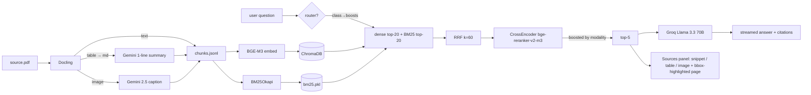

# IMF Article IV — Multimodal RAG

> **DSAI 413 assignment.** A question-answering system over a single 80-page IMF Article IV report that retrieves across **text, tables, and images** with one unified pipeline, streams grounded answers, and cites `[p.<page>, <modality>]` for every claim — backed by a Sources panel that renders the cited region of the PDF with a red bounding box.

## Architecture



**Key design decisions:**

1. **Single embedding space.** Text chunks embed directly; tables become Markdown prefixed with a 1-line Gemini summary; images become Gemini captions. One ChromaDB collection, one embedding model — modality is metadata, not a separate index.
2. **Hybrid retrieval with reranking.** Dense (BGE-M3) + BM25 → RRF (k=60) → top-20 → cross-encoder reranker → top-5 → LLM.
3. **Mandatory grounded citations.** The system prompt forces `[p.<page>, <modality>]` after every claim. The UI parses them and renders the source chunk plus the cited PDF page with a red bounding box (PyMuPDF).
4. **Optional query router.** A one-call Llama 3.1 8B classifier maps the query to `{factual, table, chart, summary}` and multiplies the rerank scores by modality boosts, tilting the final top-5 toward the expected modality without overriding the cross-encoder's semantic ranking.

## Quickstart

```bash
# 1. Install deps (https://docs.astral.sh/uv/)
uv sync

# 2. Add secrets
cp .env.example .env
# then edit .env with GOOGLE_API_KEYS (comma-separated, ≥1 key) and GROQ_API_KEY

# 3. Drop the source PDF
cp <your IMF Article IV>.pdf data/source.pdf

# 4. Parse + index (~5 min on a cold cache; ingest is cached, re-runs are <10 s)
make ingest

# 5. Chat UI
make run
# → http://localhost:8501
```

## Per-stage CLIs

```bash
uv run python -m src.ingest   --pdf data/source.pdf --out data/
uv run python -m src.index    --chunks data/chunks.jsonl --out data/chroma_db
uv run python -m src.retrieve "What is the inflation rate by year?" --debug --router
uv run python -m src.generate "What does the report say about inflation?"
```

## Tech stack

| Component | Library / model | Identifier |
| :--- | :--- | :--- |
| PDF parsing | Docling | `docling` |
| Image captioning | Gemini 2.5 Flash | `gemini-2.5-flash` |
| Embeddings (multilingual) | BGE-M3 | `BAAI/bge-m3` |
| Reranker | BGE reranker v2 | `BAAI/bge-reranker-v2-m3` |
| Vector store | ChromaDB | `chromadb` (persistent) |
| Sparse retrieval | BM25Okapi | `rank-bm25` |
| Answer LLM | Llama 3.3 70B on Groq | `llama-3.3-70b-versatile` |
| Router LLM | Llama 3.1 8B on Groq | `llama-3.1-8b-instant` |
| UI | Streamlit | `streamlit` |
| Eval | RAGAS | `ragas` |
| Page-image rendering | PyMuPDF | `pymupdf` |

## Evaluation

15 questions (5 text, 5 table, 5 image, including one Arabic) are scored with RAGAS — `faithfulness`, `answer_relevancy`, `context_precision`. RAGAS's critic LLM is pointed at Groq through the OpenAI-compatible endpoint; embeddings reuse the local BGE-M3 model.

```bash
make eval   # → eval/results.md
```

> Results will be populated once `eval/questions.json` holds the final 15 Q/A pairs. See [`eval/results.md`](eval/results.md) after running.

## Limitations

- **Single document.** The chunk store and Chroma collection are keyed to one PDF. Adding more documents needs a `doc_id` filter on every query.
- **OCR off.** Docling's OCR is disabled — the IMF PDF has an embedded text layer, but a scanned PDF would return empty text chunks and image-only captions.
- **Groq free-tier limits.** 30 req/min and 12k TPM on `llama-3.3-70b-versatile`; `src/generate.py` truncates each context block to 2 000 chars and tenacity-retries on `RateLimitError`. Upgrading Groq tier removes both constraints.
- **Gemini daily quota.** `gemini-2.5-flash` gets 20 RPD per key on the free tier; `Captioner` round-robins a comma-separated list of keys and resumes cleanly the next day if all keys hit their quota mid-run.
- **Apple MPS quirk.** BGE-M3's default `max_seq_length=8192` triggers a 128 GiB MPS buffer allocation on Apple Silicon; the project pins `max_seq_length=1024`, covering every chunk with headroom.

## Repository layout

```
src/                       # all the ML code — one module per phase
  config.py                # frozen-dataclass settings loaded from .env
  ingest.py  chunk.py  caption.py
  index.py                 # BGE-M3 + Chroma + BM25
  retrieve.py              # dense + BM25 + RRF + CrossEncoder rerank
  router.py                # Groq 8B query classifier → modality boosts
  generate.py              # Groq streaming + citation parser
app.py                     # Streamlit chat + Sources panel + PyMuPDF page render
eval/
  questions.json           # 15 Q/A pairs (5 text, 5 table, 5 image, ≥1 Arabic)
  run_eval.py              # RAGAS driver
docs/
  report.md                # 2-page technical report
  video_script.md          # 2–5 min demo script
tests/                     # pytest — unit + integration per phase
data/                      # source.pdf, chroma_db/, images/ — gitignored
CLAUDE.md                  # working-context notes + every gotcha encountered
```

## Authorship

Ahmed Kahla · DSAI 413 · AUC · Spring 2026. MIT licence.
